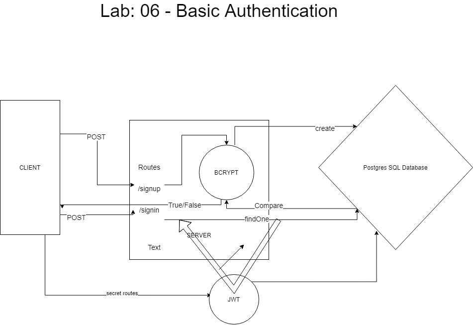

# Lab 07: Bearer Authorization

## Description

At this point, our auth-server is able to allow a user to create an account as well as to handle Basic Authentication (user provides a username + password). When a “good” login happens, the user is considered to be “authenticated” and our auth-server generates a JWT signed “Token” which is returned to the application

We will now be using that Token to re-authenticate users to shield access to any route that requires a valid login to access.

**Authentication System Phase 2:** Token (Bearer) Authentication

## Author

Ayrat Gimranov

## Collaborators

Charlie Fadness, Heather Bisgaard, Alex White(instructor)

## Version

1.0.0

## Resources

Code Feloows 401: JS starter code (Lab07) - <https://github.com/codefellows/seattle-javascript-401n19/tree/main/class-07/lab/starter-code>

## Deployed Sites

Prod branch -- https://ayrat-server-deploy-prod.herokuapp.com/
Dev branch -- https://ayrat-server-deploy-dev.herokuapp.com/

## UML

;
